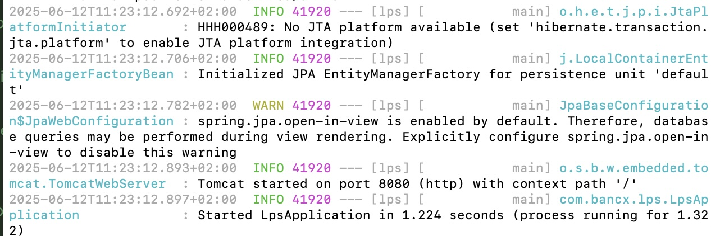

# Welcome to bancx Loan Payment System

This is the technical assignment application for the bancx loan payment system, the system is a single springboot application with a loan and a payment domain

# Compile and run tests
In order to compile and run you will need maven installed

```code
mvn install 
```
to just run the unit and integration tests standalone
```code
mvn test
```
## Running

to run the application you

```code
java -jar target/lps-0.0.1-SNAPSHOT.jar
```


# Loan API

## Create a new loan


**URL** : `/loans`

**Method** : `POST`


**Data examples**


```json
{
  "loanAmount":"1200",
  "term":"6"
}
```

**curl example**

```json
curl -X POST  -H 'Content-Type: application/json' -d'{"loanAmount":"1200","term":"6"}' http://localhost:8080/loans
```
## Success Responses


**Code** : `200 OK`

**Content example** : Response will reflect back the updated information. A
Loan with `id` of '1' and status:

```json
{
  "loanId":1,
  "loanAmount":1200,
  "term":6,
  "status":"ACTIVE"
}
```

## Error Response

**Condition** : If provided data is invalid, e.g. term id is not provided

**Code** : `400 BAD REQUEST`

**Content example** :

```json
loan term is null
```

# Query a loan


**URL** : `/loans/{loanId}`

**Method** : `GET`

**curl example**
```json
curl localhost:8080/loans/1  
```
## Success Responses


**Code** : `200 OK`

**Content example** : Response will reflect back the updated information. A
Loan with `id` of '1' and status:

```json
{
  "loanId":1,
  "loanAmount":1200,
  "term":6,
  "status":"ACTIVE"
}
```

## Error Response

**Condition** : If loan id provided does not exist, a 404 not found will be returned

**Code** : `404 NOT FOUND`

**Content example** :

```json
loan not found
```
# Payment API
## making a payment


**URL** : `/payments`

**Method** : `POST`


**Data examples**


```json
{
  "paymentAmount":200.00,
  "loan": {
    "loanId":2
  }
}
```
**curl example**
```json
curl -X POST  -d'{"paymentAmount":200.00,"loan":{"loanId":1}}'   -H 'Content-Type: application/json' localhost:8080/payments 
```

## Success Responses


**Code** : `200 OK`

**Content example** : Response will reflect back the updated information. A
payment with `id` of '1' and status:

```json
{
 "paymentId":1,
  "paymentAmount":1200.00,
  "loan":{
    "loanId":1,
    "loanAmount":0.00,
    "term":6,
    "status":"SETTLED"
  }
}
```

## Error Response

*Condition** : If the payment exceeds the loan amount a 400 bad request will be returned 

**Code** : `400 BAD REQUEST`

**Content example** :

```json
Payment amount is greater than loan amount
```

*Condition** : If the loan id given can not be found a 404 not found will be returned

**Code** : `404 NOT FOUND`

**Content example** :

```json
loan not foun
```